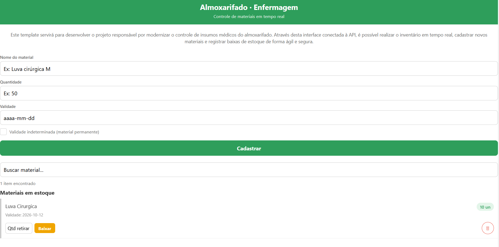

# SysAlmoxarifado 📦

Sistema mobile de controle de estoque do almoxarifado do curso técnico de enfermagem.

## Sobre o projeto

Esse app foi desenvolvido para ajudar a instrutora Camila a gerenciar o estoque de materiais do almoxarifado, substituindo as planilhas Excel por uma interface mobile conectada a uma API. O sistema permite cadastrar novos materiais e visualizar o inventário atual em tempo real.

## Tecnologias utilizadas

- React Native
- Expo
- Hooks (useState, useEffect)
- Fetch API
- Async/Await
- MockAPI.io

## Como instalar

```bash
# clone o repositório
git clone https://github.com/Universidade-Cesumar/prova-2b-dev-mobile-gcamil0

# entre na pasta do projeto
cd prova-2b-dev-mobile-gcamil0

# instale as dependências
npm install
```

## Como executar

```bash
# inicia o servidor de desenvolvimento
npm start

# ou direto no android
npm run android

# ou direto no ios
npm run ios
```

Após rodar o `npm start`, escaneie o QR Code com o aplicativo **Expo Go** no celular.

## Estrutura do projeto

prova-2b-dev-mobile-gcamil0/
├── App.js              # tela principal com formulário e listagem
├── index.js            # ponto de entrada do app
├── package.json        # dependências do projeto
├── jest.config.js      # configuração dos testes
├── tests/          # testes automatizados
│   └── sprint1.test.js
└── assets/             # imagens e ícones

## Funcionalidades da Sprint 1

- [x] Formulário de cadastro de materiais (nome e quantidade)
- [x] Listagem de materiais em tempo real via FlatList
- [x] Integração com MockAPI (GET e POST)
- [x] Carregamento com ActivityIndicator
- [x] Validação básica dos campos antes de enviar

## Funcionalidades da Sprint 2

- [x] Campo de retirada (baixa de estoque) individual por item da lista
- [x] Botão de confirmação de baixa, integrado via PUT à MockAPI
- [x] Botão de exclusão de material, integrado via DELETE à MockAPI
- [x] Função pura `validarRetirada` impedindo retiradas negativas ou maiores que o estoque atual
- [x] Confirmação antes da exclusão (Alert no mobile, confirm no navegador)
- [x] Destaque visual para materiais com estoque baixo (≤ 5 unidades)
- [x] Testes unitários da função `validarRetirada` cobrindo casos válidos e inválidos

## Funcionalidades da Sprint 3

- [x] Campo de busca com filtragem dinâmica da lista por nome
- [x] Totalizador exibindo a contagem de itens filtrados
- [x] Indicador visual de estoque crítico (quantidade menor que 10), com `accessibilityLabel="estoque-critico"`
- [x] Tratamento de erros de rede com alertas amigáveis em todas as requisições (GET, POST, PUT, DELETE)

## Funcionalidades Extras
- [x] Campo de validade com suporte a "validade indeterminada" para materiais permanentes
- [x] Indicador visual de validade (vencendo, vencido, sem validade)
- [x] Bloqueio de retirada para materiais vencidos
- [x] Auto-limitação da quantidade de retirada ao estoque disponível
- [x] Redesign visual completo (header, badges, labels, ícones)

## Screenshots

